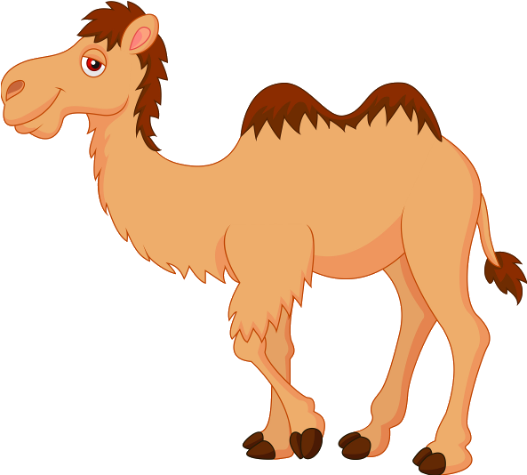
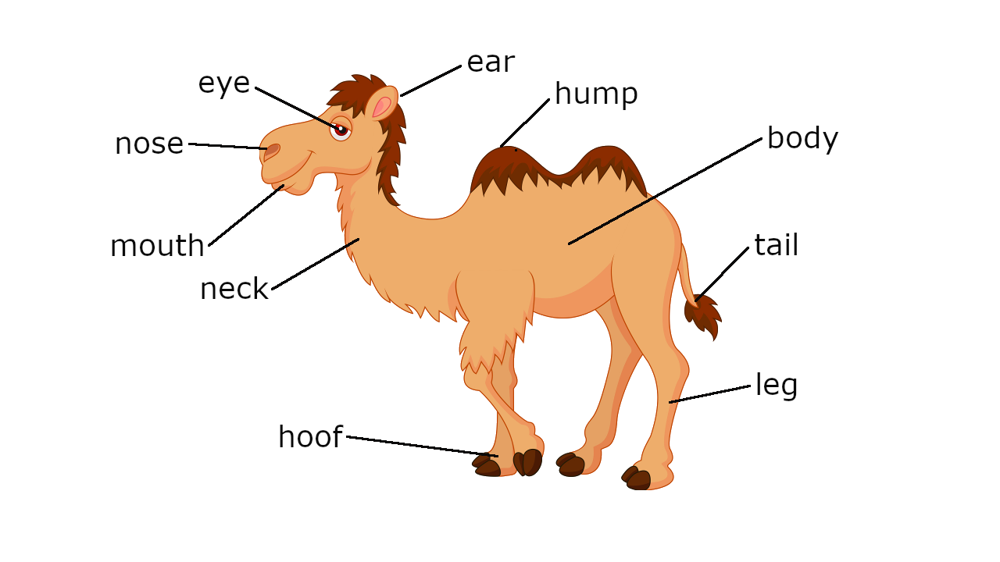
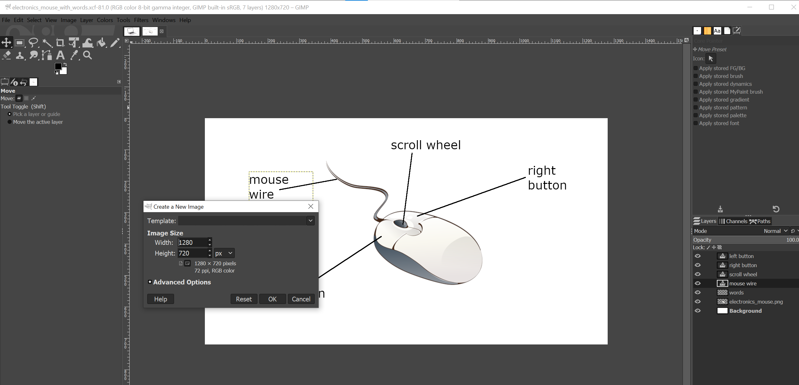

# nouns-kingdom

## Project setup
```
npm install
```

### Compiles and hot-reloads for development
```
npm run serve
```

### Compiles and minifies for production
```
npm run build
```

### Run your unit tests
```
npm run test:unit
```

### Lints and fixes files
```
npm run lint
```

### Customize configuration
See [Configuration Reference](https://cli.vuejs.org/config/).

---
---
## how to contribute to this project
### Add a new category (you can skill this part if you add a card in a existing category)
suppose you want to a new categry. You need to add it in file "nouns-kingdom\public\db_category.JSON". Please use lower cases.
```
{
  "category": [
    "animals",
    "foods",
    "fruits",
    "vegetables",
    "drinks",
    "plants", 
    "flowers",
    "clothes",
    "transportations",
    "kitchen",
    "electronics",
    "furniture",
    "new category" <--- this is the new category>
  ]
}
```
You also need to add a picture (new category.png) under "nouns-kingdom\src\assets\category", with the same category name you just added in file "db_category.JSON". The new category will be picked up and showed under the home page autumatically.

### Add cards in a existing category
You need to have two images ready for this part. The first picture's name format is categoryName_cardName.png. The second one's name is categoryName_cardName_with_words.png. You need to put both images under path "nouns-kingdom\src\assets". You also need to update the category_file.JSON under public path.

e.g. You want to add a camel card under animals category.
images:
1. animals_camel.png
1. animals_camel_with_words.png



You also need to update file "nouns-kingdom\public\db_animals.JSON".
```
    "camel": {
        "ear": "耳朵",
        "eye": "眼睛",
        "nose": "鼻子",
        "mouth": "嘴巴",
        "neck": "脖子",
        "leg": "腿",
        "hoof": "蹄子",
        "tail": "尾巴",
        "body": "身体",
        "hump": "驼峰"
    },
```
You can now start the project and see the cards you just added. It will be showed on screen automatically.


---
Image editing software:
I use windows 10, and install GIMP to add words to a picture.
when you create a new image, choose tempate: 1280 * 720 px. Font size: 38px
